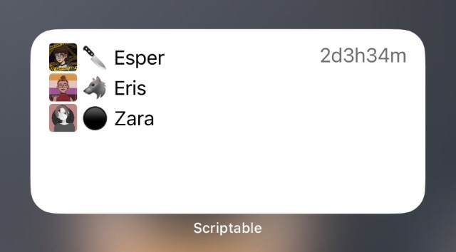

# iris' misc pluralkit stuff

Oh boy, I didn't expect people to **use** this stuff!

## ScriptablePKFronters.js

An opinionated PluralKit fronter display widget, for [Scriptable][] on
iOS. Options are set in the `userOptions` object at the top of the script.

[Scriptable]: https://scriptable.app/

## imggrab.py

Python script to mass grab images linked from a PluralKit export JSON file.

This script will grab avatars/icons (including proxy avatars for members)
and banners, for your system + members + groups, outputting them all into
a folder named after your system's short ID (the 5 character random ID).

[**If you don't know how to use this, click here!**](./docs/imggrab.md)
