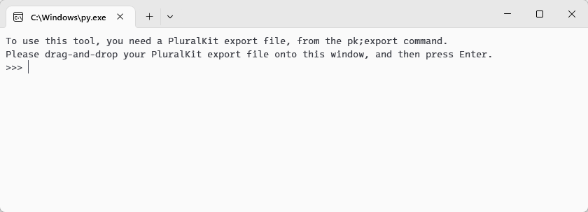

# How to use `imggrab` if you've never touched Python before

## Before you start

You will need two things before you start - your PluralKit export file
(from the `pk;export` bot command); and Python installed on your computer.

Save your PluralKit export file somewhere you can easily find it - like on
your desktop. You'll need to know where the file is in later steps, and
the script will (by default) save all your system's images in a new folder
in the same place as your export file.

You will need at least Python version 3.10, but any later version will work:

- **On Windows 10/11:** Install Python from the Microsoft Store.
   [Python 3.12 is available on the Microsoft Store here.][py-msstore]
- On Linux, Python is probably already installed. There are too many Linux
   distributions with differing instructions for me to tell you how to figure
   that out here, though.
- On other platforms - including macOS - you can download Python from
   [the Python.org website here.][py-dl]

## Getting and running the script

[Download the script by right-clicking on this link][imggrab-raw] and clicking
"Save link as..." (or similar, depending on your browser). Save it somewhere 
easy to find - in the same place as your export file is a good place.

Double-click on the downloaded `imggrab` file on your computer, and you should
see a window pop up like this:

At this point, you'll want to do exactly that - drag your PluralKit export file
from a File Explorer / Finder window onto the `imggrab` window, and press Enter.

The script will automatically start downloading all your avatars and banners,
and will place them in a new folder named after your system's 5-character ID,
usually alongside where you saved your export file. When the script starts to
download all your system images, the window will show the location it's saving
to - if the script can't find somewhere adequate to save the images to, it will
ask you to create a new folder and drag that onto the window in the same way
you did for the export file.

If any error occurs, the error message will show up in that window, and the script
will pause. Take a screenshot of the window, and send that to Iris in the
`#third-party-discussion` channel of the [PluralKit Discord server][pk-discord].

After everything's done, there will be a message that says "Script finished -
press Enter to exit" - pressing Enter at this point will close the window.

[py-dl]: https://python.org/downloads/
[py-msstore]: https://www.microsoft.com/store/productid/9NCVDN91XZQP
[imggrab-raw]: https://raw.githubusercontent.com/u1f408/pkmisc/main/imggrab.py
[pk-discord]: https://discord.gg/PczBt78